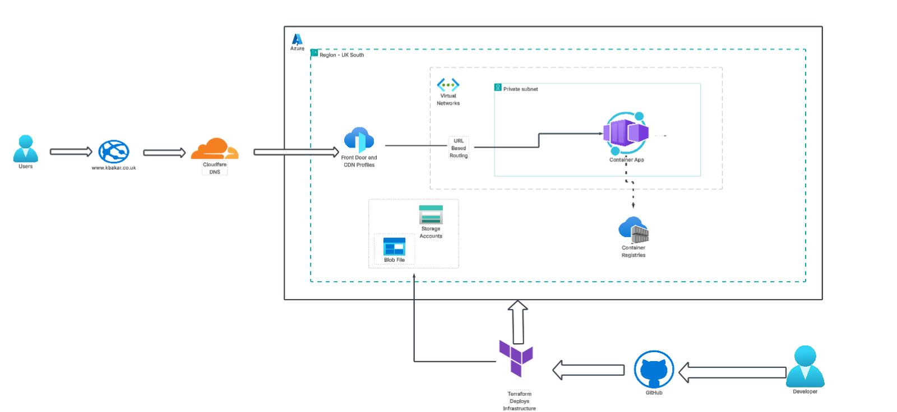
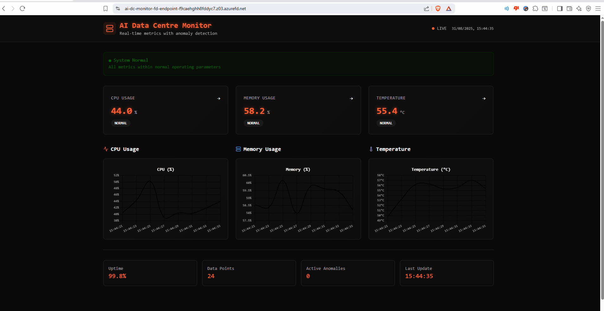
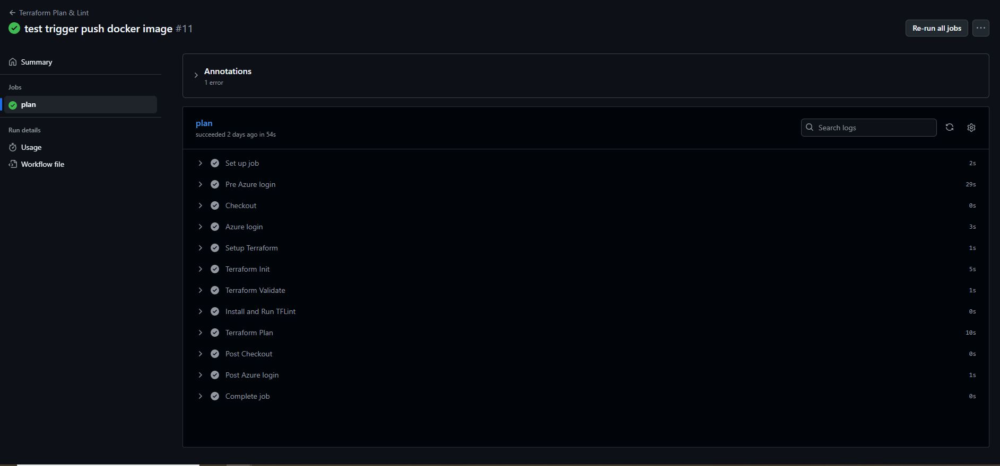
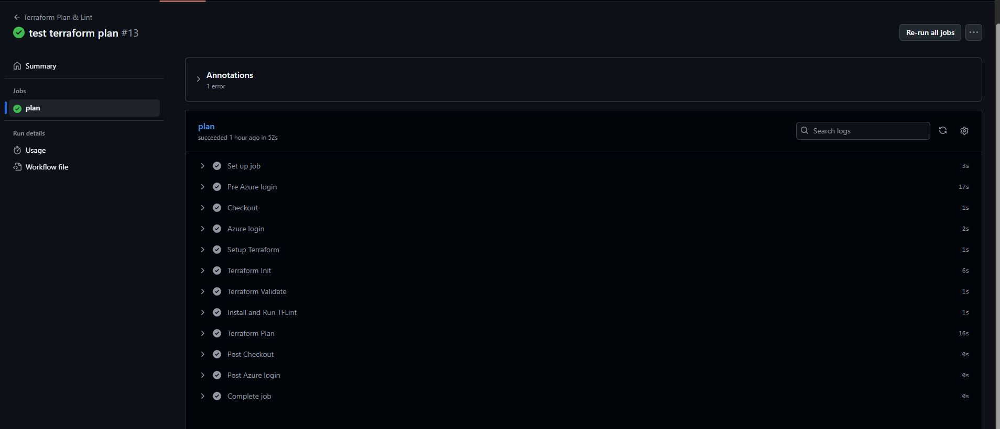
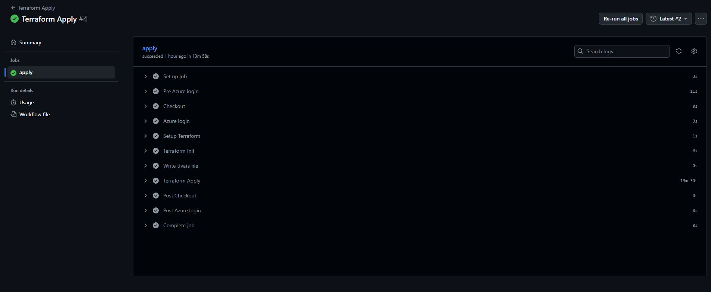
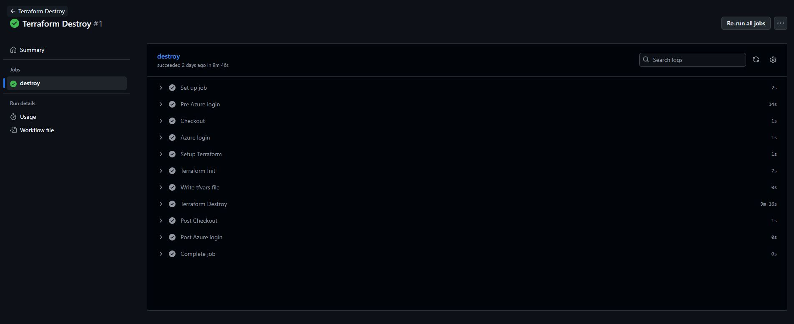
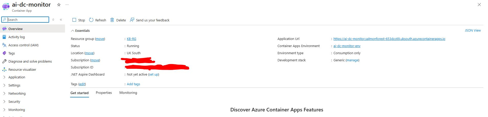
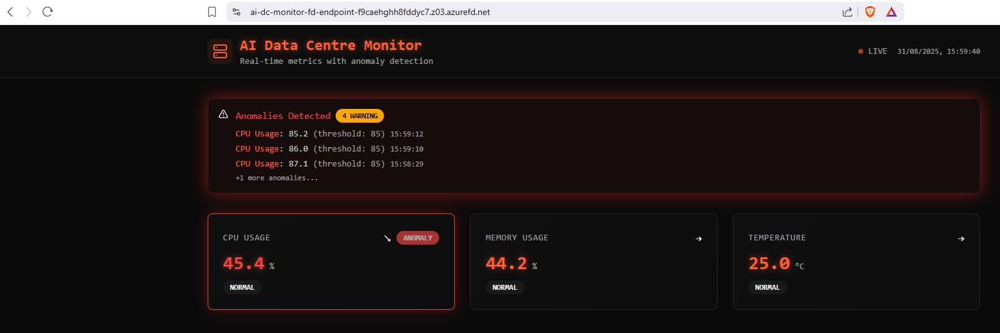

🚀 AI Data Centre Monitor
📖 Overview

The AI Data Centre Monitor is a containerized web application that provides a real-time dashboard for monitoring simulated CPU, memory, and temperature metrics.

It includes basic anomaly detection logic (e.g., CPU > 80% or temperature > 75°C flagged as anomaly) to simulate how AI/ML could be integrated in production.

While the current version uses rule-based detection, the system could be extended with ML models for advanced forecasting and anomaly detection in a real-world scenario.

🎯 Project Goals

This project was built to demonstrate a complete DevOps workflow, from local code to cloud infrastructure:

📦 Containerize the app using Docker  

🔐 Push images securely to Azure Container Registry (ACR) with vulnerability scanning  

🏗 Provision infrastructure as code (IaC) with Terraform modules  

⚙️ Enable CI/CD automation using GitHub Actions (Plan, Apply, Destroy, Build & Push)  

🌍 Serve the app publicly over HTTPS using Azure Front Door integrated with a custom domain (managed via Cloudflare DNS)  


🏗 Architecture

The following diagram shows how the solution is structured:




🎥AI Data Center Monitor App Demo




## 🛠 Main Features and Services  

| Component                          | Description                                                        |
|-----------------------------|---------------------------------------------------------------------------|
| **Azure Container Registry (ACR)** | Stores Docker images pushed from GitHub workflows                  |
| **Azure Container Apps (ACA)**     | Hosts and scales the AI Data Centre Monitor containerised app      |
| **Azure Front Door**               | Public-facing endpoint, supports HTTPS, domain routing             |
| **Terraform**                      | Automates provisioning of Azure infrastructure                     |
| **GitHub Actions**                 | CI/CD pipelines for building, scanning, and deploying              |
| **Trivy**                          | Security scanning of Docker containers                             |
| **TFLint**                         | Validates Terraform for syntax and standards                       |


## 📂 Project Structure

```
├── .github
│   └── workflows
│       ├── push-docker-image.yml # CI: Build & push Docker image to ACR
│       ├── terraform-plan.yml    # CI: Terraform plan (preview infra changes)
│       ├── terraform-apply.yml   # CD: Terraform apply (deploy infra)
│       └── terraform-destroy.yml # CD: Terraform destroy (teardown infra)
│
├── app # AI Data Center Monitor app
│
├── terraform
│   ├── modules # Reusable Terraform modules
│   │   ├── az_container_app      # Container App module
│   │   ├── az_container_registry # ACR module
│   │   ├── frontdoor             # Azure Front Door module
│   │   ├── identity              # Managed Identity module
│   │   ├── network               # Networking (VNet/Subnet) module
│   │   └── role_assignments      # RBAC role assignments
│   │
│   ├── backend.tf       # Remote backend config (Azure Storage for tfstate)
│   ├── main.tf          # Root Terraform file
│   ├── output.tf        # Global outputs
│   ├── terraform.tfvars # Variable values
│   └── variables.tf     # Input variables
│
├── .dockerignore
├── .gitignore
└── README.md
```

## 🚀 Deployment Workflow  

The deployment of the **AI Data Centre Monitor** is fully automated with **GitHub Actions** and **Terraform**, running through these stages:  

1. **Dockerisation**  
   The app (inside `app/`) is containerised with the project’s `Dockerfile`, ensuring it runs in a consistent environment across development and production.  

2. **Build & Push to ACR (`push-docker-image.yml`)**  
   When changes are pushed to the `main` branch that affect the app or `Dockerfile`, this workflow runs:  
   - Builds a new Docker image  
   - Scans the image with **Trivy** for vulnerabilities  
   - Pushes the validated image to **Azure Container Registry (ACR)**  

3. **Terraform Validation (`terraform-plan.yml`)**  
   On every push to `main` that modifies Terraform files, this workflow validates the infrastructure code:  
   - Runs `terraform plan` to preview changes  
   - Checks code style with **TFLint**  
   - Performs security checks with **Checkov**  

4. **Infrastructure Provisioning (`terraform-apply.yml`)**  
   Also triggered by pushes to `main`, this workflow runs `terraform apply` to provision and update Azure resources:  
   - **Azure Container Apps** to host the container  
   - **Azure Container Registry (ACR)** for storing images  
   - **Virtual Network & Managed Identity** for secure access  
   - **Azure Front Door** to provide HTTPS traffic routing and custom domain support  

5. **🌍 Live Application**  
   Once deployed, the container is pulled from ACR into **Azure Container Apps**.  
   **Azure Front Door** routes secure HTTPS traffic to the app via the custom domain (`kbakar.co.uk`), making it instantly available to users.  

6. **Teardown (`terraform-destroy.yml`)**  
   A manually triggered workflow is available to cleanly remove all Azure resources using `terraform destroy`. This helps reset the environment or control costs.  


## 🔐 GitHub Secrets  

Sensitive configuration values are stored in **GitHub Secrets** to keep credentials and environment variables secure during automation.  

Secrets are injected into the workflows (`push-docker-image.yml`, `terraform-plan.yml`, `terraform-apply.yml`, and `terraform-destroy.yml`) to handle tasks such as:  

- Authenticating to **Azure** with a service principal  
- Storing **Terraform remote state** backend details  
- Supplying environment-specific values (e.g., resource group, ACR name, domain)  
- Ensuring container images are built, scanned, and deployed without exposing secrets in code  

By centralising sensitive values in GitHub Secrets, the workflows remain secure, repeatable, and portable across environments.  


## ⚙️ GitHub Actions (CI/CD)

### 🔁 Push Docker Image  



### 🔁 Terraform Plan  



### 🔁 Terraform Apply  



### 🔁 Terraform Destroy  




## 🔵 Azure Container App & Front Door


### ▶️ Azure Container Apps Overview  







_
